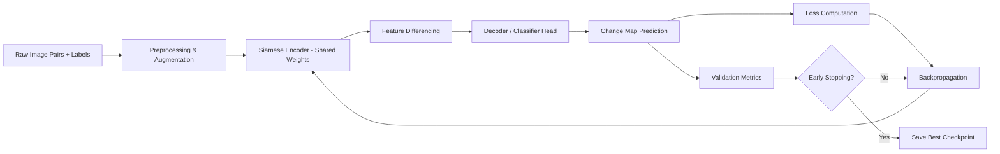

# 🛰️ OrbitalDelta — Product Requirements Document

## Satellite Image Change Detection System

| Field           | Value                                      |
| --------------- | ------------------------------------------ |
| **Version**     | 3.0                                        |
| **Date**        | 2026-03-10                                 |
| **Team**        | Solo / small-team (zero-budget, open-source) |
| **Author**      | OrbitalDelta Team                          |
| **Status**      | Approved — Ready for Implementation        |
| **Priority**    | P0 — Core Model Training & Validation      |
| **Budget**      | $0 — fully open-source stack               |

---

## 1. Executive Summary

**OrbitalDelta** is a production-grade deep-learning system that detects meaningful environmental and infrastructure changes between satellite images captured at different times. The system uses a **Siamese Convolutional Neural Network** architecture to compare *before* and *after* image pairs and produce pixel-level change maps.

**Primary focus (Phase 1):** Model training, evaluation, and perfection on established change detection benchmarks.

**Constraint:** This project operates on a **zero-budget**, leveraging exclusively open-source tools, free-tier cloud services, publicly available datasets, and community-maintained libraries. No paid APIs, proprietary software, or commercial data sources are used.

---

## 2. Problem Statement

### 2.1 Problem

Satellite imaging generates petabytes of geospatial data daily. Manually identifying meaningful changes — urban expansion, deforestation, disaster damage, illegal construction — is:

- **Slow**: Analysts take hours to compare image pairs over even small regions.
- **Error-prone**: Human fatigue causes missed changes and false positives.
- **Unscalable**: Coverage demands far exceed available analyst capacity.

### 2.2 Why It Matters

| Domain                     | Impact of Missed Changes                                    |
| -------------------------- | ----------------------------------------------------------- |
| Urban expansion monitoring | Unplanned sprawl, stressed infrastructure                   |
| Deforestation tracking     | Irreversible biodiversity loss, carbon emission spikes      |
| Disaster damage assessment | Delayed emergency response, loss of life                    |
| Illegal construction       | Regulatory non-compliance, environmental degradation        |
| Infrastructure monitoring  | Undetected pipeline/road/bridge failures                    |

### 2.3 Current Gap

Existing solutions either require expensive commercial platforms (e.g., Planet Analytics, Maxar) or rely on traditional image differencing methods (pixel subtraction, PCA) that cannot distinguish *meaningful* structural change from noise (lighting shifts, seasonal vegetation, cloud cover, sensor drift).

OrbitalDelta closes this gap using **only open-source tools and free datasets**, proving that state-of-the-art change detection is achievable without commercial licensing.

---

## 3. Target Users

| Persona                    | Use Case                                                   |
| -------------------------- | ---------------------------------------------------------- |
| Government agencies        | Land-use compliance, urban planning, disaster response      |
| Environmental NGOs         | Deforestation alerts, habitat degradation monitoring        |
| Insurance companies        | Pre/post disaster property damage verification              |
| Defence & intelligence     | Infrastructure change detection in regions of interest      |
| Researchers & academics    | Climate change impact studies, GIS research                 |

### 3.1 User Stories

- As an **urban planner**, I want to upload two satellite images of a city zone taken 6 months apart and receive a highlighted map of new constructions so I can update land-use records.
- As a **disaster response analyst**, I need to compare pre- and post-event images and get a damage change map within minutes so I can prioritize rescue deployment.
- As an **environmental researcher**, I want to detect deforestation patches between yearly images so I can quantify forest cover loss for a published study.
- As an **insurance assessor**, I need to verify property damage claims by comparing satellite imagery before and after a reported natural disaster.
- As a **defence analyst**, I want to monitor infrastructure changes in a region of interest between weekly flyovers and flag anomalies.

---

## 4. Solution Overview

### 4.1 Input

Two co-registered satellite images of the **same geographic location** captured at **different timestamps** (T1 and T2).

- Format: GeoTIFF, PNG, or JPEG
- Channels: RGB (minimum), multispectral (enhancement)
- Resolution: 0.5m–10m ground sampling distance (GSD)

### 4.2 Output

A **binary change map** (pixel-level) indicating areas of change vs. no-change, with optional:

- Probability heatmap (confidence per pixel)
- Region-level bounding boxes around changed areas
- Change category labels (Phase 2 enhancement)
- **Georeferenced GeoTIFF** preserving original CRS and geotransform
- **Vector polygons** with area (m²), centroid, confidence per change region

### 4.3 Architecture — Siamese CNN

```
┌────────────────────────────────────────────────────────┐
│                    INFERENCE PIPELINE                   │
│                                                        │
│   Image T1 ──► ┌──────────┐                            │
│                │  Encoder  │──► Feature                 │
│                │ (Shared   │    Map F1 ──┐              │
│                │  Weights) │             │  Difference   │
│   Image T2 ──► │           │──► Feature  ├─► Module ──► │
│                │           │    Map F2 ──┘              │
│                └──────────┘         ▼                   │
│                              ┌────────────┐            │
│                              │  Decoder / │            │
│                              │ Classifier │            │
│                              └─────┬──────┘            │
│                                    ▼                   │
│                              Change Map                │
└────────────────────────────────────────────────────────┘
```

**Key Design Decisions:**

| Component             | Choice                             | Rationale                                                |
| --------------------- | ---------------------------------- | -------------------------------------------------------- |
| Backbone encoder      | ResNet-18 / ResNet-34 (pretrained) | Strong feature extraction, manageable compute             |
| Weight sharing        | Full Siamese (tied weights)        | Ensures consistent feature space for both timestamps      |
| Difference module     | Concatenation + absolute diff      | Captures both correlation and magnitude of change         |
| Decoder               | U-Net–style skip-connected decoder | Preserves spatial detail for pixel-level prediction       |
| Loss function         | Binary Cross-Entropy + Dice Loss   | Handles class imbalance (most pixels are "no change")     |
| Output activation     | Sigmoid                            | Pixel-wise probability ∈ [0, 1]                          |

---

## 5. Datasets

### 5.1 Primary Benchmark Datasets

| Dataset       | Source            | Size          | Resolution | Pairs  | Change Types                     |
| ------------- | ----------------- | ------------- | ---------- | ------ | -------------------------------- |
| **LEVIR-CD**  | Beihang Univ.     | 637 pairs     | 0.5m       | 1024×1024 | Building construction/demolition |
| **WHU-CD**    | Wuhan Univ.       | 1 pair (large)| 0.075m     | 32507×15354 | Building changes                |
| **DSIFN-CD**  | Multiple sources  | 3,940 pairs   | 2m         | 512×512 | Multi-class urban changes        |
| **CDD**       | Lebedev et al.    | 16,000 pairs  | Various    | 256×256 | Season-robust change detection   |
| **OSCD**      | Sentinel-2        | 24 pairs      | 10m        | Various | Urban changes (multispectral)    |

### 5.2 Data Split Strategy

| Split       | Ratio | Purpose                         |
| ----------- | ----- | ------------------------------- |
| Training    | 70%   | Model learning                  |
| Validation  | 15%   | Hyperparameter tuning, early stopping |
| Test        | 15%   | Final unbiased evaluation       |

### 5.3 Data Augmentation Pipeline

```
Random Horizontal Flip → Random Vertical Flip → Random Rotation (90°/180°/270°)
→ Random Crop (256×256 from 1024×1024) → Color Jitter (brightness, contrast)
→ Gaussian Noise → Normalization (ImageNet stats)
```

> **Critical:** Augmentations MUST be applied identically to both T1 and T2 images in each pair to preserve spatial alignment.

---

## 6. Model Training Specification

### 6.1 Training Configuration

| Parameter             | Value                           |
| --------------------- | ------------------------------- |
| Framework             | PyTorch ≥ 2.0                   |
| Optimizer             | AdamW                           |
| Initial learning rate | 1e-3                            |
| LR scheduler          | CosineAnnealingWarmRestarts     |
| Weight decay          | 1e-4                            |
| Batch size            | 8–16 (based on GPU memory)      |
| Epochs                | 100–200 (with early stopping)   |
| Early stopping        | Patience = 15 (on val F1)       |
| Mixed precision       | FP16 via `torch.cuda.amp`       |
| Gradient clipping     | Max norm = 1.0                  |

### 6.2 Loss Function

```python
L_total = α · BCE(ŷ, y) + β · DiceLoss(ŷ, y)
```

| Term       | Weight (default) | Purpose                                  |
| ---------- | ---------------- | ---------------------------------------- |
| BCE        | α = 0.5          | Pixel-level classification accuracy       |
| Dice Loss  | β = 0.5          | Region overlap, handles class imbalance   |

### 6.3 Training Pipeline



---

## 7. Evaluation Metrics

### 7.1 Primary Metrics

| Metric       | Formula                                      | Target   |
| ------------ | -------------------------------------------- | -------- |
| **F1 Score** | 2·(P·R) / (P+R)                             | ≥ 0.88   |
| **IoU**      | TP / (TP + FP + FN)                          | ≥ 0.80   |
| **Precision**| TP / (TP + FP)                               | ≥ 0.85   |
| **Recall**   | TP / (TP + FN)                               | ≥ 0.85   |
| **OA**       | (TP + TN) / Total                            | ≥ 0.95   |
| **Kappa**    | Cohen's Kappa                                | ≥ 0.80   |

### 7.2 SOTA Baselines (LEVIR-CD Benchmark)

Our F1 ≥ 0.88 target is calibrated against published results:

| Method              | Year | F1     | IoU    | Notes                               |
| ------------------- | ---- | ------ | ------ | ----------------------------------- |
| FC-Siam-diff        | 2018 | 0.862  | 0.757  | Our architectural starting point     |
| FC-Siam-conc        | 2018 | 0.839  | 0.722  | Concatenation-only baseline          |
| STANet              | 2020 | 0.879  | 0.784  | Spatial-temporal attention           |
| BIT (Transformer)   | 2021 | 0.910  | 0.835  | Bitemporal image transformer         |
| SNUNet-CD           | 2021 | 0.920  | 0.852  | Dense Siamese, current SOTA          |
| **OrbitalDelta (target)** | — | **≥ 0.880** | **≥ 0.800** | Competitive with STANet, above FC-Siam |

> Our 0.88 F1 target is realistic for a Siamese U-Net architecture — above the FC-Siam baseline (~0.86) and approaching attention-based methods. Phase 2 attention enhancements aim to close the gap with BIT/SNUNet.

### 7.3 Secondary Metrics

- **AUC-ROC**: Area under the receiver operating curve
- **FPS**: Inference speed (frames per second) — target ≥ 5 FPS on single GPU
- **Parameter count**: Target < 20M parameters
- **Model size**: Target < 100MB (for deployment feasibility)

### 7.4 Qualitative Evaluation

- Visual comparison of predicted vs. ground-truth change maps
- Failure case analysis (false positives from seasonal change, cloud shadows)
- Edge sharpness of detected change regions

---

## 8. Project Structure

```
OrbitalDelta/
├── PRD.md                    # This document
├── README.md                 # Setup and usage guide
├── requirements.txt          # Python dependencies
├── setup.py                  # Package configuration
│
├── configs/                  # Training/inference configs (YAML)
│   ├── train_levir.yaml
│   ├── train_whu.yaml
│   └── inference.yaml
│
├── data/                     # Dataset directory (gitignored)
│   ├── raw/                  # Original downloads
│   ├── processed/            # Preprocessed splits
│   └── augmented/            # On-the-fly (not stored)
│
├── src/
│   ├── __init__.py
│   ├── models/
│   │   ├── __init__.py
│   │   ├── siamese_unet.py   # Core Siamese U-Net model
│   │   ├── encoders.py       # Backbone encoders (ResNet variants)
│   │   ├── decoders.py       # U-Net decoder with skip connections
│   │   └── losses.py         # BCE + Dice combined loss
│   │
│   ├── data/
│   │   ├── __init__.py
│   │   ├── dataset.py        # PyTorch Dataset for image pairs
│   │   ├── transforms.py     # Paired augmentation pipeline
│   │   └── download.py       # Dataset download utilities
│   │
│   ├── training/
│   │   ├── __init__.py
│   │   ├── trainer.py        # Training loop with logging
│   │   ├── evaluator.py      # Metric computation
│   │   └── scheduler.py      # LR scheduling utilities
│   │
│   └── utils/
│       ├── __init__.py
│       ├── visualization.py  # Change map overlays, comparison plots
│       ├── metrics.py        # F1, IoU, Kappa computation
│       └── geo_utils.py      # GeoTIFF reading, CRS handling
│
├── scripts/
│   ├── train.py              # Entry point: model training
│   ├── evaluate.py           # Entry point: model evaluation
│   ├── predict.py            # Entry point: inference on new pairs
│   └── visualize.py          # Generate visual comparison reports
│
├── notebooks/
│   ├── 01_data_exploration.ipynb
│   ├── 02_model_analysis.ipynb
│   └── 03_results_visualization.ipynb
│
├── checkpoints/              # Saved model weights (gitignored)
├── logs/                     # TensorBoard / W&B logs (gitignored)
├── outputs/                  # Prediction outputs (gitignored)
│
└── tests/
    ├── test_model.py
    ├── test_dataset.py
    ├── test_metrics.py
    ├── test_registration.py
    ├── test_tiling.py
    ├── test_geospatial.py
    ├── test_postprocessing.py
    ├── test_storage.py
    └── test_api.py
```

#### System Layer Directories (Post-Model)

```
src/
├── registration/             # Image alignment module
│   ├── __init__.py
│   ├── feature_matching.py   # ORB/SIFT feature detection
│   ├── homography.py         # RANSAC homography estimation
│   └── warping.py            # Image warping + error metrics
│
├── tiling/                   # Large image processing
│   ├── __init__.py
│   ├── splitter.py           # Overlap-aware tile splitting
│   ├── stitcher.py           # Seam-free tile stitching
│   └── padding.py            # Edge padding utilities
│
├── geospatial/               # Geo-aware I/O
│   ├── __init__.py
│   ├── reader.py             # GeoTIFF CRS/transform extraction
│   ├── writer.py             # Georeferenced output generation
│   └── crs_utils.py          # CRS validation and reprojection
│
├── postprocessing/           # Change object extraction
│   ├── __init__.py
│   ├── connected_components.py  # Region labeling
│   ├── polygonizer.py        # Mask → polygon conversion
│   └── attributes.py         # Area, centroid, bbox, confidence
│
├── storage/                  # Spatial database layer
│   ├── __init__.py
│   ├── models.py             # SQLAlchemy/GeoAlchemy2 schema
│   ├── geopackage.py         # GeoPackage backend (default)
│   └── postgis.py            # PostGIS backend (optional)
│
├── api/                      # REST service layer
│   ├── __init__.py
│   ├── app.py                # FastAPI application
│   ├── routes.py             # Endpoint definitions
│   ├── schemas.py            # Pydantic request/response models
│   └── background.py         # Async inference tasks
│
└── web/                      # Visualization interface
    ├── templates/
    │   └── map.html           # Leaflet + OpenStreetMap viewer
    └── static/
        ├── app.js             # Map interaction logic
        └── style.css          # UI styling
│
scripts/
├── pipeline.py               # End-to-end processing CLI
└── serve.py                  # API server launcher

---

## 9. Technology Stack

| Layer           | Technology                                        |
| --------------- | ------------------------------------------------- |
| Language        | Python 3.10+                                      |
| Deep Learning   | PyTorch 2.x, torchvision                          |
| Image I/O       | rasterio, GDAL, Pillow, OpenCV                    |
| Augmentation    | Albumentations                                    |
| Experiment tracking | Weights & Biases (wandb) or TensorBoard        |
| Config management   | Hydra or YAML + argparse                        |
| Metrics         | scikit-learn, torchmetrics                        |
| Visualization   | matplotlib, seaborn                               |
| Geospatial      | rasterio, geopandas, shapely                      |
| Testing         | pytest                                            |
| Linting         | ruff, black, mypy                                 |
| Version control | Git + DVC (for data versioning)                   |
| GPU compute     | Local GPU / Google Colab (free tier) / Kaggle Notebooks (free GPU) |

### 9.1 Zero-Cost Resource Map

| Resource                | Source                                             | Cost  |
| ----------------------- | -------------------------------------------------- | ----- |
| LEVIR-CD dataset        | [Kaggle](https://kaggle.com/datasets) / [HuggingFace](https://huggingface.co/datasets) / [Google Drive](https://justchenhao.github.io/LEVIR/) | Free  |
| WHU-CD dataset          | [Wuhan Univ.](http://gpcv.whu.edu.cn/data/building_dataset.html) | Free  |
| Reference implementation | [likyoo/Siam-NestedUNet](https://github.com/likyoo/Siam-NestedUNet) (PyTorch) | Free  |
| Reference implementation | [Rish-01/PyTorch-Siamese-CNN](https://github.com/Rish-01/PyTorch-Siamese-CNN) | Free  |
| GPU training             | Local NVIDIA GPU / Google Colab free tier / Kaggle Notebooks (30h/week) | Free  |
| Experiment tracking      | [Weights & Biases](https://wandb.ai) (free for personal) or TensorBoard (local) | Free  |
| CI/CD                    | GitHub Actions (2000 min/month free)               | Free  |
| Model hosting (Phase 3)  | HuggingFace Spaces / Gradio (free tier)            | Free  |
| Code quality             | ruff, black, mypy, pre-commit (all OSS)            | Free  |
| Documentation            | MkDocs + GitHub Pages                              | Free  |
| Image registration       | OpenCV (ORB/SIFT + RANSAC)                         | Free  |
| REST API                 | FastAPI, uvicorn, pydantic                         | Free  |
| Spatial database         | GeoPackage (default) / PostGIS (optional)          | Free  |
| Spatial operations       | shapely, geopandas, fiona                          | Free  |
| ORM                      | SQLAlchemy + GeoAlchemy2                           | Free  |
| Web mapping              | Leaflet.js + OpenStreetMap tiles                   | Free  |
| Polygon extraction       | scipy (connected components), shapely              | Free  |

---

## 10. Development Phases & Milestones

### Phase 1 — Core Model Training & Perfection (Primary Focus)

| #  | Milestone                         | Deliverable                          | Duration  |
| -- | --------------------------------- | ------------------------------------ | --------- |
| 1  | Project setup & data pipeline     | Working dataloader, augmentations    | Week 1    |
| 2  | Baseline Siamese CNN              | Training loop, basic encoder-decoder | Week 2    |
| 3  | Training on LEVIR-CD              | Trained baseline, TensorBoard logs   | Week 3    |
| 4  | Metric evaluation & tuning        | F1 ≥ 0.85 on validation set         | Week 4    |
| 5  | Advanced loss & regularization    | Dice + focal loss, dropout tuning    | Week 5    |
| 6  | Cross-dataset generalization      | Test on WHU-CD, DSIFN-CD             | Week 6    |
| 7  | Model perfection                  | F1 ≥ 0.88, ablation study complete   | Week 7–8  |

### Phase 2 — System Layer (Post-Model Implementation)

| #  | Milestone                         | Deliverable                             | Duration  |
| -- | --------------------------------- | --------------------------------------- | --------- |
| 8  | Image registration module         | Auto-alignment with error thresholding  | Week 9    |
| 9  | Tiling engine                     | Large-image split/stitch pipeline       | Week 9–10 |
| 10 | Geospatial I/O                    | GeoTIFF read/write with CRS preservation| Week 10   |
| 11 | Change object extraction          | Polygons with area, centroid, confidence| Week 11   |
| 12 | Spatial database                  | GeoPackage storage + PostGIS optional   | Week 11–12|
| 13 | REST API (FastAPI)                | Submit, query, retrieve endpoints       | Week 12–13|
| 14 | Visualization (Leaflet)           | Browser-based map viewer                | Week 13–14|
| 15 | System pipeline integration       | End-to-end CLI + API orchestration      | Week 14   |

### Phase 3 — Model Enhancements (Post System)

| Enhancement                         | Description                                              | Priority |
| ----------------------------------- | -------------------------------------------------------- | -------- |
| Attention mechanisms                | Add CBAM / Self-attention to encoder                     | High     |
| Multi-scale feature fusion          | FPN-style lateral connections                            | High     |
| Multispectral input support         | Extend to 4–13 band Sentinel-2 inputs                   | Medium   |
| Multi-class change detection        | Classify *type* of change (building, vegetation, water)  | Medium   |
| Temporal sequence (>2 images)       | LSTM/Transformer over time series                        | Low      |
| Lightweight model (MobileNet)       | Edge-deployable variant                                  | Low      |

---

## 11. Edge Cases & Error Handling

| Scenario                              | Handling Strategy                                            |
| ------------------------------------- | ------------------------------------------------------------ |
| Images are misaligned / not co-registered | Auto-detect via feature-point matching; reject pairs with alignment error > 5px; log warning |
| Different spatial resolutions (T1 ≠ T2) | Resample to lower resolution using bilinear interpolation before inference |
| Cloud cover > 50% on either image      | Flag as "low confidence"; return partial change map with confidence mask |
| Different sensors (e.g., Sentinel-2 vs Landsat) | Normalize to common radiometric range; warn user about reduced accuracy |
| Extreme seasonal difference (winter vs summer) | Apply season-robust augmentation during training; document known false-positive patterns |
| Corrupt / unreadable input files       | Validate file headers before processing; return descriptive error code |
| Single-channel or unusual band count   | Validate expected channel count; reject with clear error if input doesn't match model expectations |

---

## 12. Risk Assessment

| Risk                                      | Impact | Likelihood | Mitigation                                              |
| ----------------------------------------- | ------ | ---------- | ------------------------------------------------------- |
| Class imbalance (few change pixels)        | High   | High       | Dice/Focal loss, oversampling changed patches            |
| Domain shift across datasets               | High   | Medium     | Multi-dataset training, domain adaptation                |
| Misalignment between T1 and T2             | High   | Medium     | Preprocessing co-registration, spatial transformer nets  |
| Seasonal / lighting false positives        | Medium | High       | Robust augmentation, season-aware training               |
| Compute resource constraints               | Medium | Medium     | Mixed precision, gradient checkpointing, smaller crops   |
| Overfitting on small datasets              | Medium | Medium     | Dropout, weight decay, early stopping, data augmentation |

---

## 13. Success Criteria

### Phase 1 Exit Criteria (Minimum Viable Model)

- [ ] F1 Score ≥ 0.88 on LEVIR-CD test set
- [ ] IoU ≥ 0.80 on LEVIR-CD test set
- [ ] Inference speed ≥ 5 FPS on single GPU (RTX 3060 or equivalent)
- [ ] Model size < 100MB
- [ ] Cross-dataset evaluation completed (WHU-CD, DSIFN-CD)
- [ ] Ablation study comparing encoder backbones (ResNet-18 vs 34 vs 50)
- [ ] Training reproducible from single config command
- [ ] Qualitative analysis report with ≥ 20 visual examples

---

## 14. Out of Scope (Phase 1)

- Real-time video stream processing
- 3D change detection (elevation/DSM changes)
- Commercial satellite data ingestion APIs
- User-facing web application
- Multi-class semantic change segmentation
- Cloud/shadow removal preprocessing
- On-device / edge model deployment

---

## 15. Dependencies & Prerequisites

- **Hardware**: NVIDIA GPU with ≥ 8GB VRAM (RTX 3060+ recommended)
- **Software**: CUDA 11.8+, cuDNN 8.x, Python 3.10+
- **Data access**: Download permissions for LEVIR-CD, WHU-CD benchmark datasets
- **Storage**: ≥ 50GB for datasets + checkpoints

---

## 16. Data Governance

- All benchmark datasets (LEVIR-CD, WHU-CD, DSIFN-CD, CDD, OSCD) are **publicly available** under academic/research use licenses — no cost.
- No personally identifiable information (PII) is present in satellite imagery at ≥ 0.5m GSD.
- Commercial satellite data (Planet, Maxar, Airbus) will **not** be used — project operates on zero-budget open data only.
- Model weights trained on public data may be shared freely under open licenses (MIT/Apache-2.0).
- Geospatial coordinates in outputs should be treated as sensitive when applied to private properties or restricted zones.
- Google Earth imagery terms: LEVIR-CD is derived from Google Earth; usage must comply with Google's fair-use policy for research.

---

## 17. Responsible Use

Change detection technology is inherently **dual-use**. While designed for environmental monitoring, disaster response, and urban planning, it can also be applied to surveillance.

- This project is developed for **environmental monitoring, humanitarian, and research purposes**.
- Users deploying in defence/intelligence contexts must comply with applicable national laws and international humanitarian law.
- The model does not identify individuals — it detects structural and land-cover changes only.
- We encourage transparent reporting of use cases and discourage covert surveillance applications.
- All code and model weights are released under open-source licenses to maximize accessibility.

---

## 18. References

1. Chen, H., & Shi, Z. (2020). *A Spatial-Temporal Attention-Based Method and a New Dataset for Remote Sensing Image Change Detection*. Remote Sensing.
2. Daudt, R. C., Le Saux, B., & Boulch, A. (2018). *Fully Convolutional Siamese Networks for Change Detection*. ICIP.
3. Fang, S., et al. (2021). *SNUNet-CD: A Densely Connected Siamese Network for Change Detection of VHR Images*. IEEE GRSL.
4. Chen, H., et al. (2021). *Remote Sensing Image Change Detection with Transformers*. IEEE TGRS. (BIT)
5. LEVIR-CD Dataset: https://justchenhao.github.io/LEVIR/
6. WHU Building Change Detection Dataset: http://gpcv.whu.edu.cn/data/building_dataset.html

---

> **Document Control:** This PRD is a living document (v3.0). Update version number and date with each revision. All changes require review before model training begins.
