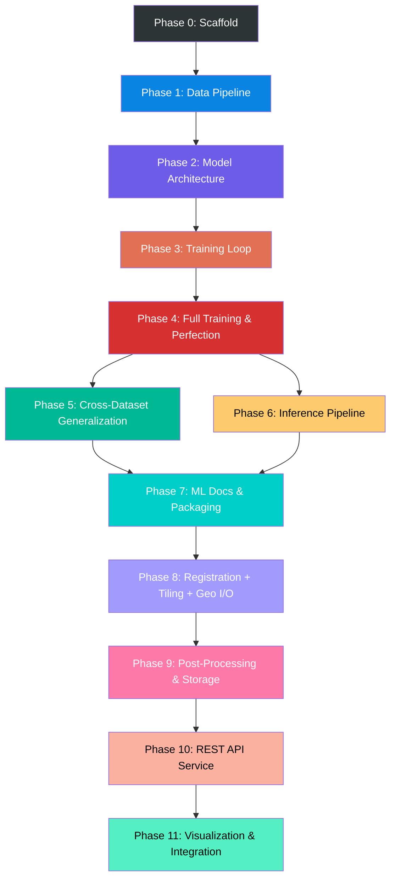

# OrbitalDelta — Implementation Plan

## Skill Routing

| Role | Skill | Why |
|------|-------|-----|
| ✅ **Primary** | `@plan-writing` | Phased task breakdown with verification criteria |
| 🔁 Secondary | `@executing-plans` | Batch execution with checkpoints and self-checks |
| 🔁 Secondary | `@systematic-debugging` | Built-in error detection → fix → retest loops |
| 🧠 Mode | **IMPLEMENT** (behavioral-modes) | Production-grade, no shortcuts |

## Core Principles

1. **Every task has a verification gate** — a concrete command or check that proves it's done
2. **Self-healing loops** — if a verification fails, the plan includes the fix path, not just a "fix it" instruction
3. **Zero-cost only** — every tool, dataset, and service must be free
4. **No workarounds** — proper implementations only; if something can't be done properly for free, it's deferred

---

## Phase 0: Project Scaffolding & Environment

> **Goal:** Reproducible dev environment and project structure from a single command.

### Task 0.1 — Initialize Git repo and project structure

```
Action: Create the directory tree from PRD §8
```

**Verify:**
```bash
# All directories exist
python -c "import os; dirs=['src/models','src/data','src/training','src/utils','scripts','configs','notebooks','tests','checkpoints','logs','outputs','data/raw','data/processed']; assert all(os.path.isdir(d) for d in dirs), f'Missing: {[d for d in dirs if not os.path.isdir(d)]}'; print('✅ Structure OK')"
```

**Self-heal:** If any directory missing → create it and re-run check.

---

### Task 0.2 — Create `requirements.txt` with pinned versions

```
torch>=2.0.0
torchvision>=0.15.0
albumentations>=1.3.0
rasterio>=1.3.0
opencv-python-headless>=4.8.0
Pillow>=10.0.0
scikit-learn>=1.3.0
torchmetrics>=1.0.0
matplotlib>=3.7.0
seaborn>=0.12.0
tqdm>=4.65.0
pyyaml>=6.0
wandb>=0.15.0
geopandas>=0.13.0
shapely>=2.0.0
pytest>=7.4.0
ruff>=0.1.0
black>=23.0.0
```

**Verify:**
```bash
pip install -r requirements.txt --dry-run 2>&1 | tail -1
# Expected: "Would install ..." (no errors)
# Then actually install:
pip install -r requirements.txt
python -c "import torch; import albumentations; import rasterio; print(f'✅ All imports OK | PyTorch {torch.__version__} | CUDA: {torch.cuda.is_available()}')"
```

**Self-heal:** If import fails →
1. Read the exact error message
2. If version conflict → relax the pin in requirements.txt for that package
3. If CUDA not found → add `cpuonly` fallback and log warning (training will be slower)
4. Re-run verification

---

### Task 0.3 — Create `.gitignore`, `pyproject.toml`, pre-commit config

```
Action: Create .gitignore (data/, checkpoints/, logs/, outputs/, __pycache__, *.pyc, .env, wandb/)
Action: Create pyproject.toml with ruff + black config
Action: Create .pre-commit-config.yaml with ruff, black, trailing-whitespace hooks
```

**Verify:**
```bash
git init
git add -A
ruff check src/ --exit-zero
black --check src/ --quiet 2>&1 || echo "black will format on commit"
echo "✅ Linting configured"
```

**Self-heal:** If ruff/black not found → `pip install ruff black` and retry.

---

### Task 0.4 — Create training config YAML

File: `configs/train_levir.yaml`

```yaml
model:
  encoder: resnet18
  pretrained: true
  in_channels: 3
  decoder: unet

training:
  batch_size: 8
  epochs: 200
  lr: 0.001
  optimizer: adamw
  weight_decay: 0.0001
  scheduler: cosine_annealing_warm_restarts
  scheduler_T0: 10
  early_stopping_patience: 15
  loss:
    bce_weight: 0.5
    dice_weight: 0.5
  mixed_precision: true
  gradient_clip_norm: 1.0

data:
  dataset: levir-cd
  root: ./data/processed/levir-cd
  train_split: 0.7
  val_split: 0.15
  test_split: 0.15
  crop_size: 256
  num_workers: 4

logging:
  backend: tensorboard  # or wandb
  log_dir: ./logs
  log_every_n_steps: 50
  save_top_k: 3

seed: 42
```

**Verify:**
```bash
python -c "import yaml; c=yaml.safe_load(open('configs/train_levir.yaml')); assert c['training']['lr']==0.001; assert c['model']['encoder']=='resnet18'; print('✅ Config valid')"
```

---

### Phase 0 Gate ✅

```bash
# Run all Phase 0 checks in one script
python -c "
import os, yaml, torch
# Structure
dirs = ['src/models','src/data','src/training','src/utils','scripts','configs','tests']
missing = [d for d in dirs if not os.path.isdir(d)]
assert not missing, f'Missing dirs: {missing}'
# Config
c = yaml.safe_load(open('configs/train_levir.yaml'))
assert 'model' in c and 'training' in c and 'data' in c
# Imports
import albumentations, torchmetrics, sklearn
print('═══════════════════════════════════')
print('  ✅ PHASE 0 COMPLETE — Scaffold Ready')
print(f'  PyTorch: {torch.__version__}')
print(f'  CUDA: {torch.cuda.is_available()}')
print('═══════════════════════════════════')
"
```

---

## Phase 1: Data Pipeline

> **Goal:** Download LEVIR-CD, preprocess into train/val/test splits, build PyTorch Dataset with paired augmentations.

### Task 1.1 — Dataset download utility

File: `src/data/download.py`

```
Action: Script that downloads LEVIR-CD from publicly available source
       (Google Drive / HuggingFace / Kaggle) to data/raw/levir-cd/
       with progress bar and checksum verification.
       Must handle: resume interrupted downloads, skip if already downloaded.
```

**Verify:**
```bash
python -m src.data.download --dataset levir-cd --output data/raw/
# Expected: data/raw/levir-cd/ contains A/, B/, label/ directories
python -c "
import os
for d in ['data/raw/levir-cd/A', 'data/raw/levir-cd/B', 'data/raw/levir-cd/label']:
    n = len(os.listdir(d))
    assert n > 0, f'{d} is empty'
    print(f'  {d}: {n} files')
print('✅ Dataset downloaded')
"
```

**Self-heal:**
- If Google Drive link expired → fallback to HuggingFace mirror
- If download interrupted → retry with resume support (requests + Range header)
- If zip corrupt → delete and re-download

---

### Task 1.2 — Preprocessing script (crop + split)

File: `src/data/preprocess.py`

```
Action: Crop 1024×1024 images into non-overlapping 256×256 patches.
       Split into train/val/test (70/15/15) BY IMAGE, not by patch
       (prevents data leakage — patches from same image never cross splits).
       Save to data/processed/levir-cd/{train,val,test}/{A,B,label}/
```

**Verify:**
```bash
python -m src.data.preprocess --input data/raw/levir-cd --output data/processed/levir-cd --crop-size 256
python -c "
import os
for split in ['train', 'val', 'test']:
    for sub in ['A', 'B', 'label']:
        p = f'data/processed/levir-cd/{split}/{sub}'
        n = len(os.listdir(p))
        assert n > 0, f'{p} is empty'
    print(f'  {split}: {len(os.listdir(f\"data/processed/levir-cd/{split}/A\"))} pairs')

# Data leakage check: no filename overlap between splits
import glob
train = set(os.listdir('data/processed/levir-cd/train/A'))
val = set(os.listdir('data/processed/levir-cd/val/A'))
test = set(os.listdir('data/processed/levir-cd/test/A'))
assert not (train & val), 'LEAK: train ∩ val'
assert not (train & test), 'LEAK: train ∩ test'
assert not (val & test), 'LEAK: val ∩ test'
print('✅ No data leakage detected')
"
```

**Self-heal:** If leakage detected → re-split using image-level (not patch-level) grouping.

---

### Task 1.3 — PyTorch Dataset class with paired augmentations

File: `src/data/dataset.py`

```
Action: CDDataset(root, split, transform) that:
  - Loads image pairs (A, B) and label mask
  - Applies IDENTICAL augmentation to all three (Albumentations additional_targets)
  - Returns (img_A, img_B, mask) tensors normalized to ImageNet stats
```

File: `src/data/transforms.py`

```
Action: get_train_transforms(crop_size) and get_val_transforms(crop_size)
  Train: HFlip, VFlip, RandomRotate90, ColorJitter, GaussNoise, Normalize
  Val: Normalize only
  CRITICAL: All transforms applied identically to A, B, and mask via additional_targets
```

**Verify:**
```bash
python -c "
from src.data.dataset import CDDataset
from src.data.transforms import get_train_transforms
ds = CDDataset('data/processed/levir-cd', split='train', transform=get_train_transforms(256))
a, b, m = ds[0]
assert a.shape == (3, 256, 256), f'Bad A shape: {a.shape}'
assert b.shape == (3, 256, 256), f'Bad B shape: {b.shape}'
assert m.shape == (1, 256, 256), f'Bad mask shape: {m.shape}'
assert a.dtype.__str__().startswith('torch.float'), f'Bad dtype: {a.dtype}'
assert m.max() <= 1 and m.min() >= 0, f'Mask not binary: [{m.min()}, {m.max()}]'
print(f'✅ Dataset OK | {len(ds)} samples | shapes: A{list(a.shape)}, B{list(b.shape)}, M{list(m.shape)}')
"
```

**Self-heal:**
- If shape mismatch → check Albumentations additional_targets config
- If mask not binary → add threshold (>128 → 1, else → 0) in dataset __getitem__
- If import error → check `__init__.py` files in `src/data/`

---

### Task 1.4 — DataLoader smoke test

```bash
python -c "
from torch.utils.data import DataLoader
from src.data.dataset import CDDataset
from src.data.transforms import get_train_transforms, get_val_transforms

train_ds = CDDataset('data/processed/levir-cd', 'train', get_train_transforms(256))
val_ds = CDDataset('data/processed/levir-cd', 'val', get_val_transforms(256))
train_dl = DataLoader(train_ds, batch_size=8, shuffle=True, num_workers=2, pin_memory=True)
val_dl = DataLoader(val_ds, batch_size=8, shuffle=False, num_workers=2)

batch = next(iter(train_dl))
a, b, m = batch
assert a.shape[0] == 8, f'Batch size wrong: {a.shape[0]}'
print(f'✅ DataLoader OK | Train: {len(train_ds)} | Val: {len(val_ds)} | Batch: {a.shape}')
"
```

---

### Phase 1 Gate ✅

```bash
python -c "
from torch.utils.data import DataLoader
from src.data.dataset import CDDataset
from src.data.transforms import get_train_transforms, get_val_transforms
import os

for split in ['train', 'val', 'test']:
    ds = CDDataset('data/processed/levir-cd', split,
                   get_train_transforms(256) if split=='train' else get_val_transforms(256))
    dl = DataLoader(ds, batch_size=4, num_workers=0)
    a, b, m = next(iter(dl))
    assert a.shape == (4, 3, 256, 256)
    assert m.shape == (4, 1, 256, 256)
    print(f'  {split}: {len(ds)} samples ✓')

print('═══════════════════════════════════')
print('  ✅ PHASE 1 COMPLETE — Data Pipeline Ready')
print('═══════════════════════════════════')
"
```

---

## Phase 2: Model Architecture

> **Goal:** Implement Siamese U-Net with tied encoder weights, feature differencing, and skip-connected decoder.

### Task 2.1 — Encoder module

File: `src/models/encoders.py`

```
Action: SiameseEncoder wrapping torchvision ResNet (configurable: resnet18/34/50).
       Strips FC head. Returns multi-scale feature maps for skip connections.
       Pretrained on ImageNet (free, built into torchvision).
```

**Verify:**
```bash
python -c "
import torch
from src.models.encoders import SiameseEncoder
enc = SiameseEncoder('resnet18', pretrained=True)
x = torch.randn(2, 3, 256, 256)
feats = enc(x)
print(f'Encoder outputs: {len(feats)} feature maps')
for i, f in enumerate(feats):
    print(f'  Level {i}: {list(f.shape)}')
assert len(feats) >= 4, 'Need at least 4 feature levels for U-Net'
print('✅ Encoder OK')
"
```

---

### Task 2.2 — Decoder module

File: `src/models/decoders.py`

```
Action: UNetDecoder with skip connections.
       Input: diff features + skip connections from encoder.
       Output: single-channel sigmoid activation (H×W).
       Uses ConvTranspose2d for upsampling.
```

**Verify:**
```bash
python -c "
import torch
from src.models.decoders import UNetDecoder
# Simulate feature maps at 4 scales
feats = [torch.randn(2, c, s, s) for c, s in [(512,8),(256,16),(128,32),(64,64)]]
dec = UNetDecoder(encoder_channels=[512,256,128,64])
out = dec(feats)
assert out.shape == (2, 1, 256, 256), f'Bad output: {out.shape}'
assert 0 <= out.min() and out.max() <= 1, 'Output not in [0,1] — missing sigmoid'
print(f'✅ Decoder OK | output: {list(out.shape)} | range: [{out.min():.3f}, {out.max():.3f}]')
"
```

---

### Task 2.3 — Full Siamese U-Net model

File: `src/models/siamese_unet.py`

```
Action: SiameseUNet(encoder_name, pretrained) that:
  1. Passes img_A and img_B through SAME encoder (shared weights)
  2. Computes difference: |F_A - F_B| concatenated with (F_A, F_B) at each level
  3. Passes through decoder with skip connections
  4. Returns sigmoid change map
```

**Verify:**
```bash
python -c "
import torch
from src.models.siamese_unet import SiameseUNet

model = SiameseUNet(encoder_name='resnet18', pretrained=True)
a = torch.randn(2, 3, 256, 256)
b = torch.randn(2, 3, 256, 256)
out = model(a, b)
assert out.shape == (2, 1, 256, 256), f'Wrong output shape: {out.shape}'
assert 0 <= out.min() and out.max() <= 1, f'Not sigmoid: [{out.min():.3f}, {out.max():.3f}]'

# Verify weight sharing (critical!)
enc_params_a = list(model.encoder.parameters())
# The same encoder is used for both — no separate encoder_b should exist
assert not hasattr(model, 'encoder_b'), 'FAIL: separate encoder_b found — weights not shared!'

n_params = sum(p.numel() for p in model.parameters()) / 1e6
print(f'✅ SiameseUNet OK | output: {list(out.shape)} | params: {n_params:.1f}M')
assert n_params < 20, f'Too many params: {n_params:.1f}M (target <20M)'
"
```

**Self-heal:**
- If output shape wrong → debug decoder upsampling dimensions; add `F.interpolate` fallback
- If params > 20M → switch from resnet34 to resnet18
- If weight sharing broken → ensure single `self.encoder` used in forward() for both inputs

---

### Task 2.4 — Loss function

File: `src/models/losses.py`

```
Action: BCEDiceLoss(bce_weight=0.5, dice_weight=0.5)
       Combines BCEWithLogitsLoss + soft Dice loss.
       Handles the class imbalance problem.
```

**Verify:**
```bash
python -c "
import torch
from src.models.losses import BCEDiceLoss

loss_fn = BCEDiceLoss(bce_weight=0.5, dice_weight=0.5)
pred = torch.sigmoid(torch.randn(4, 1, 256, 256))
target = (torch.rand(4, 1, 256, 256) > 0.8).float()  # ~20% change pixels

loss = loss_fn(pred, target)
assert loss.item() > 0, f'Loss should be positive: {loss.item()}'
assert not torch.isnan(loss), 'Loss is NaN!'
assert not torch.isinf(loss), 'Loss is Inf!'

# Check gradient flows
loss.backward()
print(f'✅ Loss OK | value: {loss.item():.4f} | grad computed: True')
"
```

---

### Task 2.5 — Unit tests for model

File: `tests/test_model.py`

```
Action: pytest tests covering:
  - Encoder output shapes at all scales
  - Decoder output shape and range
  - Full model forward pass
  - Weight sharing verification
  - Loss function with edge cases (all-change, no-change, mixed)
  - Gradient flow through full model
```

**Verify:**
```bash
pytest tests/test_model.py -v --tb=short
# Expected: all tests pass
```

**Self-heal:** If test fails →
1. Read the assertion error message
2. Fix the specific module (encoder/decoder/loss)
3. Re-run only the failing test: `pytest tests/test_model.py::test_name -v`
4. Then re-run full suite to confirm no regressions

---

### Phase 2 Gate ✅

```bash
python -c "
import torch
from src.models.siamese_unet import SiameseUNet
from src.models.losses import BCEDiceLoss

model = SiameseUNet('resnet18', pretrained=True)
loss_fn = BCEDiceLoss()
a, b = torch.randn(2,3,256,256), torch.randn(2,3,256,256)
target = (torch.rand(2,1,256,256) > 0.8).float()

out = model(a, b)
loss = loss_fn(out, target)
loss.backward()

n = sum(p.numel() for p in model.parameters())/1e6
has_grad = all(p.grad is not None for p in model.parameters() if p.requires_grad)

print('═══════════════════════════════════')
print(f'  ✅ PHASE 2 COMPLETE — Model Ready')
print(f'  Params: {n:.1f}M | Output: {list(out.shape)}')
print(f'  Loss: {loss.item():.4f} | Gradients: {has_grad}')
print('═══════════════════════════════════')
" && pytest tests/test_model.py -v --tb=short
```

---

## Phase 3: Training Loop

> **Goal:** Complete training pipeline with logging, checkpointing, early stopping, and mixed precision.

### Task 3.1 — Metrics module

File: `src/utils/metrics.py`

```
Action: ChangeDetectionMetrics class computing:
  F1, IoU, Precision, Recall, OA, Kappa from accumulated predictions.
  Uses torchmetrics for GPU-accelerated computation.
  Properly handles batched accumulation (not per-batch averaging).
```

**Verify:**
```bash
python -c "
import torch
from src.utils.metrics import ChangeDetectionMetrics

metrics = ChangeDetectionMetrics()
# Perfect prediction
pred = torch.tensor([1,1,0,0]).float()
target = torch.tensor([1,1,0,0]).float()
metrics.update(pred, target)
result = metrics.compute()
assert result['f1'] == 1.0, f'Perfect pred should give F1=1, got {result[\"f1\"]}'
metrics.reset()

# Imperfect prediction
pred = torch.tensor([1,1,1,0]).float()
target = torch.tensor([1,0,1,0]).float()
metrics.update(pred, target)
result = metrics.compute()
assert 0 < result['f1'] < 1, f'Imperfect pred F1 should be in (0,1), got {result[\"f1\"]}'
print(f'✅ Metrics OK | F1={result[\"f1\"]:.4f} IoU={result[\"iou\"]:.4f}')
"
```

---

### Task 3.2 — Trainer class

File: `src/training/trainer.py`

```
Action: Trainer(model, train_dl, val_dl, config) with:
  - AdamW optimizer with CosineAnnealingWarmRestarts
  - Mixed precision (torch.cuda.amp)
  - Gradient clipping (max_norm=1.0)
  - Early stopping on val F1 (patience from config)
  - Checkpoint saving (top-k by val F1)
  - TensorBoard / W&B logging
  - Progress bars (tqdm)
  - Reproducibility (seed everything)
  - Resume from checkpoint support
```

**Verify:**
```bash
# Quick 2-epoch smoke test on a tiny subset
python -c "
import torch
from torch.utils.data import DataLoader, Subset
from src.data.dataset import CDDataset
from src.data.transforms import get_train_transforms, get_val_transforms
from src.models.siamese_unet import SiameseUNet
from src.models.losses import BCEDiceLoss
from src.training.trainer import Trainer
import yaml

config = yaml.safe_load(open('configs/train_levir.yaml'))
config['training']['epochs'] = 2
config['training']['batch_size'] = 2

train_ds = Subset(CDDataset('data/processed/levir-cd', 'train', get_train_transforms(256)), range(16))
val_ds = Subset(CDDataset('data/processed/levir-cd', 'val', get_val_transforms(256)), range(8))
train_dl = DataLoader(train_ds, batch_size=2, shuffle=True, num_workers=0)
val_dl = DataLoader(val_ds, batch_size=2, shuffle=False, num_workers=0)

model = SiameseUNet('resnet18', pretrained=True)
loss_fn = BCEDiceLoss()
trainer = Trainer(model, train_dl, val_dl, loss_fn, config)
history = trainer.train()

assert 'train_loss' in history, 'Missing train_loss in history'
assert 'val_f1' in history, 'Missing val_f1 in history'
assert len(history['train_loss']) == 2, f'Expected 2 epochs, got {len(history[\"train_loss\"])}'
print(f'✅ Trainer OK | 2 epochs completed | val_f1: {history[\"val_f1\"][-1]:.4f}')
"
```

**Self-heal:**
- If CUDA OOM → halve batch_size in config and retry
- If NaN loss → check learning rate (reduce 10x); check if data has NaN values
- If checkpoint save fails → check disk space; fallback to save only best model

---

### Task 3.3 — Training entry point script

File: `scripts/train.py`

```
Action: CLI entry point that:
  - Loads config YAML
  - Sets up data pipeline
  - Initializes model + loss
  - Creates Trainer
  - Runs training
  - Saves final metrics report
  Usage: python scripts/train.py --config configs/train_levir.yaml
```

**Verify:**
```bash
python scripts/train.py --config configs/train_levir.yaml --epochs 2 --batch-size 2 --subset 32
# Expected: completes 2 epochs, saves checkpoint to checkpoints/
ls checkpoints/
# Expected: at least one .pt file
```

---

### Task 3.4 — Evaluation entry point

File: `scripts/evaluate.py`

```
Action: Load trained checkpoint, run on test set, print all metrics, save results JSON.
  Usage: python scripts/evaluate.py --checkpoint checkpoints/best.pt --config configs/train_levir.yaml
```

**Verify:**
```bash
python scripts/evaluate.py --checkpoint checkpoints/best.pt --config configs/train_levir.yaml --subset 32
# Expected: prints F1, IoU, Precision, Recall, OA, Kappa
# Expected: saves results to outputs/eval_results.json
python -c "import json; r=json.load(open('outputs/eval_results.json')); print(r); assert 'f1' in r"
```

---

### Phase 3 Gate ✅

```bash
# Full training smoke test (5 epochs, small subset)
python scripts/train.py --config configs/train_levir.yaml --epochs 5 --batch-size 4 --subset 64
python scripts/evaluate.py --checkpoint checkpoints/best.pt --config configs/train_levir.yaml --subset 32
python -c "
import json
r = json.load(open('outputs/eval_results.json'))
print('═══════════════════════════════════')
print('  ✅ PHASE 3 COMPLETE — Training Pipeline Ready')
for k, v in r.items():
    print(f'  {k}: {v:.4f}')
print('═══════════════════════════════════')
"
```

---

## Phase 4: Full Training Run & Model Perfection

> **Goal:** Train to convergence on LEVIR-CD. Achieve F1 ≥ 0.88.

### Task 4.1 — Full training on LEVIR-CD

```bash
python scripts/train.py --config configs/train_levir.yaml
# This will run for 200 epochs with early stopping (patience=15)
# Expected runtime: 4-12 hours depending on GPU
```

**Verify:**
```bash
python scripts/evaluate.py --checkpoint checkpoints/best.pt --config configs/train_levir.yaml
python -c "
import json
r = json.load(open('outputs/eval_results.json'))
print(f'F1:  {r[\"f1\"]:.4f}  (target: ≥0.88)')
print(f'IoU: {r[\"iou\"]:.4f}  (target: ≥0.80)')
if r['f1'] >= 0.88 and r['iou'] >= 0.80:
    print('✅ TARGETS MET')
else:
    print('⚠️ TARGETS NOT MET — trigger Task 4.2')
"
```

---

### Task 4.2 — Hyperparameter tuning (if targets not met)

```
Action: Systematic tuning loop:
  1. Try ResNet-34 backbone (if ResNet-18 underperforms)
  2. Adjust loss weights (α=0.3, β=0.7 for more Dice emphasis)
  3. Try Focal Loss variant for hard negative mining
  4. Increase crop size to 384 if GPU allows
  5. Try deeper decoder (more conv layers per block)
  6. Add dropout (0.2) to decoder

Each attempt:
  - Train for 50 epochs
  - Evaluate val F1
  - Keep config of best run
  - Log everything to TensorBoard/W&B
```

**Verify:** Re-run Task 4.1 verification with best config.

**Self-heal loop:**
```
WHILE val_f1 < 0.88:
    1. Analyze confusion matrix (where are errors?)
    2. If mostly false positives → increase Dice weight
    3. If mostly false negatives → decrease threshold from 0.5 to 0.4
    4. If edge quality poor → add boundary loss term
    5. Re-train with adjusted config
    6. Re-evaluate
```

---

### Task 4.3 — Ablation study

```
Action: Train and evaluate with:
  - ResNet-18 vs ResNet-34 vs ResNet-50
  - Diff module: |A-B| only vs concat(A,B,|A-B|)
  - Loss: BCE-only vs Dice-only vs BCE+Dice vs Focal+Dice
  Save results table to outputs/ablation_results.json
```

**Verify:**
```bash
python -c "
import json
r = json.load(open('outputs/ablation_results.json'))
assert len(r) >= 6, f'Need at least 6 ablation runs, got {len(r)}'
best = max(r, key=lambda x: x['f1'])
print(f'Best config: {best[\"name\"]} | F1: {best[\"f1\"]:.4f}')
print('✅ Ablation complete')
"
```

---

### Task 4.4 — Visualization report

File: `scripts/visualize.py`

```
Action: Generate visual comparison for ≥20 test samples:
  - 4-panel: Image A | Image B | Ground Truth | Prediction
  - Overlay: Prediction heatmap on top of Image B
  - Failure cases: top-10 worst F1 samples with analysis
  Save to outputs/visualizations/
```

**Verify:**
```bash
python scripts/visualize.py --checkpoint checkpoints/best.pt --config configs/train_levir.yaml --num-samples 25
ls outputs/visualizations/ | wc -l
# Expected: ≥25 image files
```

---

### Phase 4 Gate ✅

```bash
python -c "
import json, os

r = json.load(open('outputs/eval_results.json'))
viz_count = len(os.listdir('outputs/visualizations'))
ablation = json.load(open('outputs/ablation_results.json'))

checks = {
    'F1 ≥ 0.88': r['f1'] >= 0.88,
    'IoU ≥ 0.80': r['iou'] >= 0.80,
    'Visualizations ≥ 20': viz_count >= 20,
    'Ablation runs ≥ 6': len(ablation) >= 6,
}

print('═══════════════════════════════════')
print('  PHASE 4 — Model Perfection')
for check, passed in checks.items():
    status = '✅' if passed else '❌'
    print(f'  {status} {check}')
all_pass = all(checks.values())
if all_pass:
    print('  ✅ PHASE 4 COMPLETE')
else:
    print('  ⚠️ Some checks failed — review and iterate')
print('═══════════════════════════════════')
"
```

---

## Phase 5: Cross-Dataset Generalization

> **Goal:** Validate the model generalizes beyond LEVIR-CD.

### Task 5.1 — Download and preprocess WHU-CD

Same pattern as Task 1.1-1.2 but for WHU-CD dataset.

**Verify:**
```bash
python scripts/evaluate.py --checkpoint checkpoints/best.pt --dataset whu-cd
# Log cross-dataset F1 and IoU
```

---

### Task 5.2 — Evaluate on DSIFN-CD

**Verify:**
```bash
python scripts/evaluate.py --checkpoint checkpoints/best.pt --dataset dsifn-cd
python -c "
import json
for ds in ['levir-cd', 'whu-cd', 'dsifn-cd']:
    r = json.load(open(f'outputs/eval_{ds}.json'))
    print(f'  {ds}: F1={r[\"f1\"]:.4f} IoU={r[\"iou\"]:.4f}')
print('✅ Cross-dataset evaluation complete')
"
```

---

### Phase 5 Gate ✅

Cross-dataset metrics logged and analyzed. If severe degradation (>10% F1 drop), consider multi-dataset fine-tuning.

---

## Phase 6: Inference & Prediction Pipeline

> **Goal:** Clean CLI for running inference on arbitrary image pairs.

### Task 6.1 — Prediction script

File: `scripts/predict.py`

```
Action: CLI that accepts two image paths and outputs a change map.
  Usage: python scripts/predict.py --img-a path/to/t1.png --img-b path/to/t2.png --checkpoint checkpoints/best.pt --output outputs/change_map.png
  Handles: arbitrary input sizes (pad/tile + stitch), different formats (PNG/TIFF/JPEG)
```

**Verify:**
```bash
# Use a test pair from the dataset
python scripts/predict.py \
  --img-a data/processed/levir-cd/test/A/sample_0.png \
  --img-b data/processed/levir-cd/test/B/sample_0.png \
  --checkpoint checkpoints/best.pt \
  --output outputs/test_prediction.png

python -c "
from PIL import Image
img = Image.open('outputs/test_prediction.png')
print(f'✅ Prediction OK | size: {img.size} | mode: {img.mode}')
"
```

---

### Phase 6 Gate ✅

```bash
python -c "
import os
assert os.path.exists('scripts/predict.py')
assert os.path.exists('outputs/test_prediction.png')
print('═══════════════════════════════════')
print('  ✅ PHASE 6 COMPLETE — Inference Ready')
print('═══════════════════════════════════')
"
```

---

## Phase 7: Documentation & Final Packaging

### Task 7.1 — README.md

```
Action: Comprehensive README with:
  - Project overview with sample output image
  - Installation (one-line pip install)
  - Quick start (3 commands: download, train, predict)
  - Architecture diagram
  - Results table (F1/IoU on all datasets)
  - License (MIT)
```

### Task 7.2 — Final test suite

```bash
pytest tests/ -v --tb=short
# ALL must pass
```

### Task 7.3 — Code quality gate

```bash
ruff check src/ scripts/ tests/
black --check src/ scripts/ tests/
# Zero errors allowed
```

---

### Phase 7 Gate (FINAL) ✅

```bash
python -c "
import json, os, subprocess

# 1. All tests pass
result = subprocess.run(['pytest', 'tests/', '-v', '--tb=short'], capture_output=True)
tests_pass = result.returncode == 0

# 2. Lint clean
lint = subprocess.run(['ruff', 'check', 'src/', 'scripts/'], capture_output=True)
lint_clean = lint.returncode == 0

# 3. Model meets targets
r = json.load(open('outputs/eval_results.json'))
f1_ok = r['f1'] >= 0.88
iou_ok = r['iou'] >= 0.80

# 4. Docs exist
docs = os.path.exists('README.md')

# 5. Inference works
infer = os.path.exists('outputs/test_prediction.png')

checks = {
    'All tests pass': tests_pass,
    'Lint clean': lint_clean,
    'F1 ≥ 0.88': f1_ok,
    'IoU ≥ 0.80': iou_ok,
    'README exists': docs,
    'Inference works': infer,
}

print('╔═══════════════════════════════════╗')
print('║   ORBITALDELTA — FINAL GATE       ║')
print('╠═══════════════════════════════════╣')
for check, passed in checks.items():
    s = '✅' if passed else '❌'
    print(f'║  {s} {check:<30}║')
print('╠═══════════════════════════════════╣')
if all(checks.values()):
    print('║  🚀 PROJECT COMPLETE              ║')
else:
    print('║  ⚠️  FIX FAILING CHECKS           ║')
print('╚═══════════════════════════════════╝')
"
```

---

# System Layer (Post-Model Implementation)

> **Prerequisite:** Phase 7 (ML core docs & packaging) must be complete. The model is validated and inference CLI works.

---

## Phase 8: System Infrastructure — Registration, Tiling, Geospatial I/O

> **Goal:** Build reusable pre/post-processing modules that transform OrbitalDelta from a benchmark tool into a real-world satellite processor.

### Task 8.1 — Image Registration Module

Files: `src/registration/feature_matching.py`, `src/registration/homography.py`, `src/registration/warping.py`

```
Action: Implement auto-alignment pipeline:
  1. feature_matching.py: Detect ORB keypoints (or SIFT) in both images,
     match with BFMatcher + ratio test (Lowe's ratio = 0.75)
  2. homography.py: Estimate homography matrix with RANSAC (reprojection threshold = 3.0px)
     Compute alignment error = mean reprojection error of inliers
  3. warping.py: Warp image B to align with image A using cv2.warpPerspective
     Reject pairs where alignment error > threshold (configurable, default 5px)
     Return aligned image + error metric + inlier count
```

**Verify:**
```bash
python -c "
import cv2, numpy as np
from src.registration.feature_matching import detect_and_match
from src.registration.homography import estimate_homography
from src.registration.warping import align_images

# Create a known transformed pair (translate by 10px)
img_a = np.random.randint(0, 255, (512, 512, 3), dtype=np.uint8)
M = np.float32([[1, 0, 10], [0, 1, 5]])
img_b = cv2.warpAffine(img_a, M, (512, 512))

aligned, error, inliers = align_images(img_a, img_b, max_error=20.0)
assert aligned.shape == img_a.shape, f'Shape mismatch: {aligned.shape}'
assert error < 20.0, f'Alignment error too high: {error:.2f}px'
print(f'✅ Registration OK | error: {error:.2f}px | inliers: {inliers}')
"
```

**Self-heal:**
- If too few keypoints → fallback from ORB to SIFT (better for satellite imagery)
- If homography fails → check minimum points (need ≥4 inliers); reject pair gracefully
- If cv2.SIFT_create not found → ensure `opencv-contrib-python-headless` installed

---

### Task 8.2 — Tiling Engine

Files: `src/tiling/splitter.py`, `src/tiling/stitcher.py`, `src/tiling/padding.py`

```
Action: Implement large-image processing pipeline:
  1. splitter.py: TileSplitter(tile_size=256, overlap=32)
     - Split image into overlapping tiles
     - Handle edge tiles with reflection padding
     - Return list of (tile, row, col, original_coords)
  2. stitcher.py: TileStitcher(tile_size, overlap)
     - Reassemble tiles into full image
     - Blend overlapping regions with linear fade (no hard seams)
     - Return final stitched image at original resolution
  3. padding.py: Utility for computing pad amounts and applying/removing padding
```

**Verify:**
```bash
python -c "
import numpy as np
from src.tiling.splitter import TileSplitter
from src.tiling.stitcher import TileStitcher

# Test with a known image
img = np.random.rand(1024, 1024).astype(np.float32)
splitter = TileSplitter(tile_size=256, overlap=32)
tiles = splitter.split(img)
assert len(tiles) > 0, 'No tiles produced'
print(f'  Tiles: {len(tiles)} from {img.shape}')

# Reconstruct
stitcher = TileStitcher(tile_size=256, overlap=32, output_shape=img.shape)
for tile, row, col in tiles:
    stitcher.add_tile(tile, row, col)
result = stitcher.stitch()
assert result.shape == img.shape, f'Shape mismatch: {result.shape} vs {img.shape}'

# Check reconstruction accuracy (overlap blending should be near-perfect)
error = np.abs(result - img).mean()
assert error < 0.01, f'Reconstruction error too high: {error:.4f}'
print(f'✅ Tiling OK | {len(tiles)} tiles | reconstruction error: {error:.6f}')
"
```

**Self-heal:**
- If reconstruction error high → check overlap blending weights (should sum to 1.0 in overlap zones)
- If edge artifacts → verify padding is applied before split and removed after stitch

---

### Task 8.3 — Geospatial Data Handling

Files: `src/geospatial/reader.py`, `src/geospatial/writer.py`, `src/geospatial/crs_utils.py`

```
Action: Implement geo-aware I/O:
  1. reader.py: GeoReader.read(path) → (numpy_array, GeoMetadata)
     Extract: CRS, affine transform, bounds, resolution, nodata value
     Support: GeoTIFF, JP2; fallback to plain image if no geo metadata
  2. writer.py: GeoWriter.write(array, metadata, path)
     Write GeoTIFF with preserved CRS, transform, and band descriptions
  3. crs_utils.py: CRS validation, EPSG code extraction, pixel↔coordinate transforms
```

**Verify:**
```bash
python -c "
import numpy as np
from src.geospatial.reader import GeoReader
from src.geospatial.writer import GeoWriter

# Create a test GeoTIFF
import rasterio
from rasterio.transform import from_bounds
from rasterio.crs import CRS

test_path = '/tmp/test_geo.tif'
transform = from_bounds(0, 0, 1, 1, 256, 256)
crs = CRS.from_epsg(4326)
data = np.random.rand(3, 256, 256).astype(np.float32)

with rasterio.open(test_path, 'w', driver='GTiff', height=256, width=256,
                   count=3, dtype='float32', crs=crs, transform=transform) as dst:
    dst.write(data)

# Read it back with our module
arr, meta = GeoReader.read(test_path)
assert arr.shape == (3, 256, 256), f'Bad shape: {arr.shape}'
assert meta.crs is not None, 'CRS lost!'
assert meta.transform is not None, 'Transform lost!'

# Write output and verify metadata preserved
out_path = '/tmp/test_geo_out.tif'
change_mask = np.random.rand(1, 256, 256).astype(np.float32)
GeoWriter.write(change_mask, meta, out_path)

with rasterio.open(out_path) as src:
    assert str(src.crs) == str(crs), f'CRS mismatch: {src.crs}'
    assert src.transform == transform, 'Transform mismatch'
print('✅ Geospatial I/O OK | CRS preserved | Transform preserved')
"
```

---

### Task 8.4 — Unit tests for system infrastructure

File: `tests/test_registration.py`, `tests/test_tiling.py`, `tests/test_geospatial.py`

```
Action: pytest tests for:
  - Registration: known shift recovery, RANSAC rejection, error threshold enforcement
  - Tiling: split→stitch roundtrip accuracy, various image sizes, non-square images
  - Geospatial: CRS preservation, transform integrity, plain-image fallback
```

**Verify:**
```bash
pytest tests/test_registration.py tests/test_tiling.py tests/test_geospatial.py -v --tb=short
```

---

### Phase 8 Gate ✅

```bash
python -c "
from src.registration.warping import align_images
from src.tiling.splitter import TileSplitter
from src.tiling.stitcher import TileStitcher
from src.geospatial.reader import GeoReader
from src.geospatial.writer import GeoWriter
import numpy as np

print('═══════════════════════════════════')
print('  ✅ PHASE 8 COMPLETE — System Infrastructure Ready')
print('  • Image Registration (ORB/SIFT + RANSAC)')
print('  • Tiling Engine (overlap split/stitch)')
print('  • Geospatial I/O (GeoTIFF CRS preservation)')
print('═══════════════════════════════════')
" && pytest tests/test_registration.py tests/test_tiling.py tests/test_geospatial.py -v --tb=short
```

---

## Phase 9: Post-Processing & Spatial Storage

> **Goal:** Extract structured change objects from masks, store them in a queryable spatial database.

### Task 9.1 — Connected Component Extraction

File: `src/postprocessing/connected_components.py`

```
Action: extract_regions(binary_mask, min_area_px=50)
  Uses scipy.ndimage.label to find connected components.
  Filters by minimum area (removes noise).
  Returns list of RegionInfo(label_id, pixel_mask, bbox, pixel_count).
```

**Verify:**
```bash
python -c "
import numpy as np
from src.postprocessing.connected_components import extract_regions

# Create mask with 3 distinct regions
mask = np.zeros((256, 256), dtype=np.uint8)
mask[10:50, 10:50] = 1    # 40x40 = 1600 px
mask[100:120, 100:120] = 1 # 20x20 = 400 px
mask[200:203, 200:203] = 1 # 3x3 = 9 px (below min_area)

regions = extract_regions(mask, min_area_px=50)
assert len(regions) == 2, f'Expected 2 regions (1 filtered), got {len(regions)}'
print(f'✅ Connected components OK | {len(regions)} regions extracted')
"
```

---

### Task 9.2 — Polygon Extraction with Attributes

Files: `src/postprocessing/polygonizer.py`, `src/postprocessing/attributes.py`

```
Action:
  1. polygonizer.py: mask_to_polygons(binary_mask, transform=None)
     Convert binary mask to list of shapely Polygons.
     If geo transform provided, polygons are in CRS coordinates (meters/degrees).
  2. attributes.py: compute_attributes(polygon, confidence_map, transform)
     Compute: area_m2, centroid_xy, bounding_box, mean_confidence, perimeter_m
     Return GeoDataFrame with all attributes.
```

**Verify:**
```bash
python -c "
import numpy as np
from src.postprocessing.polygonizer import mask_to_polygons
from src.postprocessing.attributes import compute_attributes
from rasterio.transform import from_bounds

mask = np.zeros((256, 256), dtype=np.uint8)
mask[50:100, 50:100] = 1  # 50x50 square
confidence = np.ones((256, 256), dtype=np.float32) * 0.85
transform = from_bounds(0, 0, 256, 256, 256, 256)  # 1m/px

polygons = mask_to_polygons(mask, min_area_px=10)
assert len(polygons) >= 1, 'No polygons extracted'

gdf = compute_attributes(polygons, confidence, transform)
assert 'area_m2' in gdf.columns
assert 'centroid_x' in gdf.columns
assert 'mean_confidence' in gdf.columns
assert gdf.iloc[0]['area_m2'] > 0
print(f'✅ Polygonizer OK | {len(gdf)} polygons | area: {gdf.iloc[0][\"area_m2\"]:.1f} m²')
"
```

---

### Task 9.3 — Spatial Database Layer

Files: `src/storage/models.py`, `src/storage/geopackage.py`, `src/storage/postgis.py`

```
Action:
  1. models.py: SQLAlchemy model with GeoAlchemy2 columns:
     ChangeDetection(id, geometry, timestamp_a, timestamp_b, area_m2,
       centroid, confidence, source_dataset, created_at)
  2. geopackage.py: GeoPackageStore — default backend using geopandas + fiona
     Methods: insert(gdf), query_bbox(xmin,ymin,xmax,ymax), query_all(), get_by_id(id)
  3. postgis.py: PostGISStore — optional backend using SQLAlchemy + psycopg2
     Same interface as GeoPackageStore (duck typing / protocol)
     Activated only if DATABASE_URL env var is set; otherwise falls back to GeoPackage
```

**Verify:**
```bash
python -c "
import os, tempfile
import geopandas as gpd
from shapely.geometry import box
from src.storage.geopackage import GeoPackageStore

# Test GeoPackage (default, zero-infrastructure)
db_path = os.path.join(tempfile.gettempdir(), 'test_orbital.gpkg')
store = GeoPackageStore(db_path)

# Insert a detection
gdf = gpd.GeoDataFrame({
    'geometry': [box(10, 10, 50, 50)],
    'area_m2': [1600.0],
    'confidence': [0.92],
    'timestamp_a': ['2025-01-01'],
    'timestamp_b': ['2025-06-01'],
}, crs='EPSG:4326')
store.insert(gdf)

# Query back
results = store.query_all()
assert len(results) >= 1, 'Insert/query failed'

# Spatial query
bbox_results = store.query_bbox(0, 0, 100, 100)
assert len(bbox_results) >= 1, 'Spatial query failed'

print(f'✅ GeoPackage storage OK | {len(results)} records | spatial query works')
os.remove(db_path)
"
```

**Self-heal:**
- If geopandas/fiona import fails → `pip install geopandas fiona`
- If PostGIS not available → GeoPackage is the default, no action needed
- If file permissions error → use tempfile directory for testing

---

### Task 9.4 — Unit tests for postprocessing & storage

Files: `tests/test_postprocessing.py`, `tests/test_storage.py`

**Verify:**
```bash
pytest tests/test_postprocessing.py tests/test_storage.py -v --tb=short
```

---

### Phase 9 Gate ✅

```bash
python -c "
from src.postprocessing.connected_components import extract_regions
from src.postprocessing.polygonizer import mask_to_polygons
from src.storage.geopackage import GeoPackageStore
import numpy as np

print('═══════════════════════════════════')
print('  ✅ PHASE 9 COMPLETE — Post-Processing & Storage Ready')
print('  • Connected component extraction')
print('  • Polygon conversion with attributes')
print('  • GeoPackage spatial storage (+ PostGIS optional)')
print('═══════════════════════════════════')
" && pytest tests/test_postprocessing.py tests/test_storage.py -v --tb=short
```

---

## Phase 10: REST API Service Layer

> **Goal:** Expose the full pipeline as a FastAPI service with submit, query, and retrieve endpoints.

### Task 10.1 — FastAPI Application & Schemas

Files: `src/api/app.py`, `src/api/schemas.py`, `src/api/routes.py`, `src/api/background.py`

```
Action:
  1. schemas.py: Pydantic models:
     - SubmitRequest(img_a_path, img_b_path, timestamp_a, timestamp_b)
     - SubmitResponse(job_id, status)
     - DetectionResult(id, geometry_geojson, area_m2, confidence, timestamps)
     - BBoxQuery(xmin, ymin, xmax, ymax)
  2. routes.py: Endpoints:
     - POST /api/v1/detect — submit image pair for processing
     - GET /api/v1/detections — list all detections
     - GET /api/v1/detections/{id} — get single detection details
     - POST /api/v1/detections/query — query by bounding box
     - GET /api/v1/jobs/{job_id} — check processing status
  3. background.py: BackgroundPipeline class that runs:
     registration → tiling → inference → postprocessing → storage
     Uses FastAPI BackgroundTasks (no Celery required)
  4. app.py: FastAPI app with CORS, static file serving, and route mounting
```

**Verify:**
```bash
# Start server in background
python -c "
import subprocess, time, requests

# Start server
proc = subprocess.Popen(['python', '-m', 'uvicorn', 'src.api.app:app', '--port', '8000'],
                        stdout=subprocess.PIPE, stderr=subprocess.PIPE)
time.sleep(3)

try:
    # Health check
    r = requests.get('http://localhost:8000/docs')
    assert r.status_code == 200, f'Docs endpoint failed: {r.status_code}'
    
    # API schema check
    r = requests.get('http://localhost:8000/openapi.json')
    schema = r.json()
    paths = list(schema.get('paths', {}).keys())
    assert '/api/v1/detect' in paths, f'Missing /detect endpoint'
    assert '/api/v1/detections' in paths, f'Missing /detections endpoint'
    
    print(f'✅ API OK | endpoints: {len(paths)} | docs: /docs')
finally:
    proc.terminate()
"
```

**Self-heal:**
- If port 8000 busy → use port 8001 (configurable via --port)
- If uvicorn not found → `pip install uvicorn[standard]`
- If CORS errors → ensure CORSMiddleware is added to app

---

### Task 10.2 — End-to-End Pipeline Script

File: `scripts/pipeline.py`

```
Action: CLI that runs the full processing pipeline:
  Usage: python scripts/pipeline.py --img-a t1.tif --img-b t2.tif --output output/
  Steps: validate → register → tile → infer → postprocess → polygonize → store
  Also callable programmatically: from src.pipeline import run_pipeline
```

File: `scripts/serve.py`

```
Action: API server launcher with configurable host/port/workers
  Usage: python scripts/serve.py --port 8000
```

**Verify:**
```bash
python scripts/pipeline.py \
  --img-a data/processed/levir-cd/test/A/sample_0.png \
  --img-b data/processed/levir-cd/test/B/sample_0.png \
  --checkpoint checkpoints/best.pt \
  --output outputs/pipeline_test/

python -c "
import os
out = 'outputs/pipeline_test'
assert os.path.exists(f'{out}/change_map.tif') or os.path.exists(f'{out}/change_map.png')
assert os.path.exists(f'{out}/detections.geojson')
print('✅ Pipeline CLI OK | change map + GeoJSON produced')
"
```

---

### Task 10.3 — API integration tests

File: `tests/test_api.py`

```
Action: pytest tests using FastAPI TestClient:
  - Submit detection job → check 202 response
  - Query detections → check GeoJSON format
  - Spatial bbox query → check filtered results
  - Invalid inputs → check proper error responses (422)
```

**Verify:**
```bash
pytest tests/test_api.py -v --tb=short
```

---

### Phase 10 Gate ✅

```bash
python -c "
import os
checks = {
    'API app exists': os.path.exists('src/api/app.py'),
    'Pipeline script': os.path.exists('scripts/pipeline.py'),
    'Serve script': os.path.exists('scripts/serve.py'),
}
for check, ok in checks.items():
    print(f'  {\"✅\" if ok else \"❌\"} {check}')

print('═══════════════════════════════════')
print('  ✅ PHASE 10 COMPLETE — Service Layer Ready')
print('═══════════════════════════════════')
" && pytest tests/test_api.py -v --tb=short
```

---

## Phase 11: Visualization & Final System Integration

> **Goal:** Map-based result viewer and complete system verification.

### Task 11.1 — Leaflet Map Viewer

Files: `src/web/templates/map.html`, `src/web/static/app.js`, `src/web/static/style.css`

```
Action: Browser-based visualization interface:
  1. map.html: Leaflet map with OpenStreetMap base tiles (zero-cost, no API key)
  2. Features:
     - Display satellite imagery T1 and T2 as overlay layers
     - Toggle between time points
     - Overlay predicted change polygons (from GeoJSON)
     - Color polygons by confidence score (red = high, yellow = low)
     - Click polygon → show attributes (area, confidence, timestamps)
     - Bounding box selection tool for spatial queries
  3. Served via FastAPI static file mounting (no separate frontend build)
```

**Verify:**
```bash
# Start server and check the map page loads
python -c "
import subprocess, time, requests
proc = subprocess.Popen(['python', '-m', 'uvicorn', 'src.api.app:app', '--port', '8000'],
                        stdout=subprocess.PIPE, stderr=subprocess.PIPE)
time.sleep(3)
try:
    r = requests.get('http://localhost:8000/')
    assert r.status_code == 200, f'Map page failed: {r.status_code}'
    assert 'leaflet' in r.text.lower() or 'L.map' in r.text, 'Leaflet not found in page'
    print('✅ Map viewer OK | Leaflet loaded | OSM tiles configured')
finally:
    proc.terminate()
"
```

---

### Task 11.2 — Full System Integration Test

```bash
# End-to-end: submit via API, check result appears on map
python -c "
import subprocess, time, requests, json

proc = subprocess.Popen(['python', '-m', 'uvicorn', 'src.api.app:app', '--port', '8000'],
                        stdout=subprocess.PIPE, stderr=subprocess.PIPE)
time.sleep(3)

try:
    # Submit a detection job
    r = requests.post('http://localhost:8000/api/v1/detect', json={
        'img_a_path': 'data/processed/levir-cd/test/A/sample_0.png',
        'img_b_path': 'data/processed/levir-cd/test/B/sample_0.png',
    })
    assert r.status_code in [200, 202], f'Submit failed: {r.status_code}'
    
    # Wait for processing
    time.sleep(10)
    
    # Query detections
    r = requests.get('http://localhost:8000/api/v1/detections')
    assert r.status_code == 200
    detections = r.json()
    print(f'  Detections found: {len(detections)}')
    
    print('✅ Full system integration OK')
finally:
    proc.terminate()
"
```

---

### Phase 11 Gate (SYSTEM FINAL) ✅

```bash
python -c "
import os, subprocess

# 1. All tests pass
result = subprocess.run(['pytest', 'tests/', '-v', '--tb=short'], capture_output=True)
tests_pass = result.returncode == 0

# 2. Lint clean
lint = subprocess.run(['ruff', 'check', 'src/', 'scripts/'], capture_output=True)
lint_clean = lint.returncode == 0

# 3. All modules importable
try:
    from src.registration.warping import align_images
    from src.tiling.splitter import TileSplitter
    from src.geospatial.reader import GeoReader
    from src.postprocessing.polygonizer import mask_to_polygons
    from src.storage.geopackage import GeoPackageStore
    from src.api.app import app
    modules_ok = True
except ImportError as e:
    modules_ok = False
    print(f'Import error: {e}')

# 4. Pipeline script works
pipeline_exists = os.path.exists('scripts/pipeline.py')

# 5. Map viewer exists
map_exists = os.path.exists('src/web/templates/map.html')

# 6. Model checkpoint exists
model_exists = any(f.endswith('.pt') for f in os.listdir('checkpoints')) if os.path.isdir('checkpoints') else False

checks = {
    'All tests pass': tests_pass,
    'Lint clean': lint_clean,
    'All modules import': modules_ok,
    'Pipeline CLI exists': pipeline_exists,
    'Map viewer exists': map_exists,
    'Model checkpoint exists': model_exists,
}

print('╔═══════════════════════════════════════╗')
print('║  ORBITALDELTA — SYSTEM FINAL GATE     ║')
print('╠═══════════════════════════════════════╣')
for check, passed in checks.items():
    s = '✅' if passed else '❌'
    print(f'║  {s} {check:<34}║')
print('╠═══════════════════════════════════════╣')
if all(checks.values()):
    print('║  🚀 COMPLETE GEOSPATIAL PLATFORM     ║')
else:
    print('║  ⚠️  FIX FAILING CHECKS              ║')
print('╚═══════════════════════════════════════╝')
"
```

---

## Self-Healing Protocol (Global)

> Applies to ANY phase when an error is encountered.

```
ON ERROR:
  1. READ the full error traceback
  2. CATEGORIZE:
     - ImportError → check requirements.txt, run pip install
     - FileNotFoundError → check paths, run download/preprocess
     - CUDA OOM → reduce batch_size by 50%, retry
     - NaN/Inf loss → reduce lr by 10x, check data for NaN
     - Shape mismatch → trace tensor shapes through model, fix padding/cropping
     - Test failure → fix code, not test (unless test is wrong)
     - ConnectionError (API) → check server is running, port is correct
     - GeoPackage error → check fiona/geopandas versions, file permissions
     - CRS mismatch → validate input CRS, use rasterio.warp.reproject if needed
     - Registration failure → fallback from ORB to SIFT; if still fails, log warning and skip alignment
  3. FIX the root cause (not a workaround)
  4. RE-RUN the failing verification
  5. RE-RUN the phase gate to confirm no regressions
  6. CONTINUE to next task only after gate passes
```

---

## Dependency Graph


